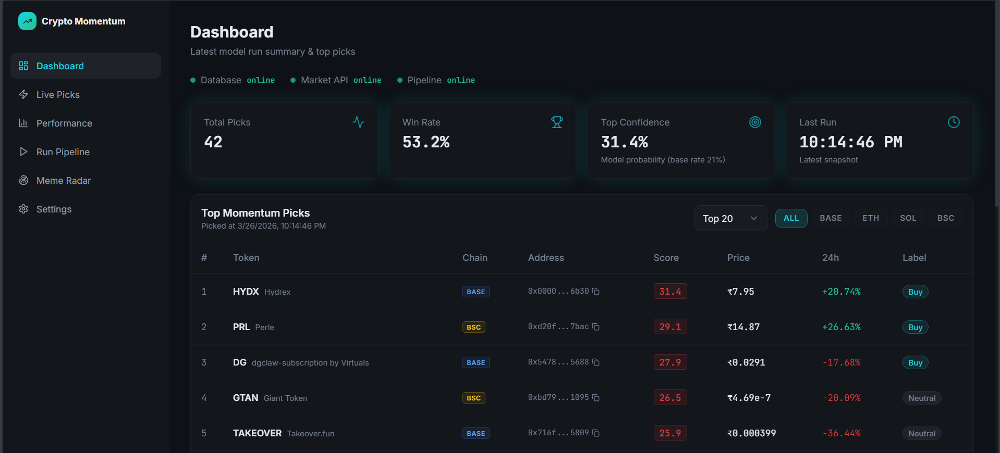
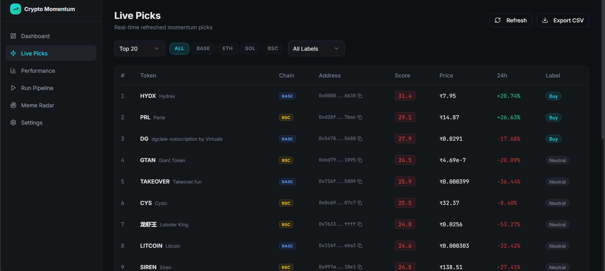
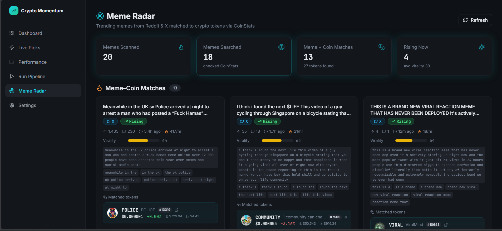
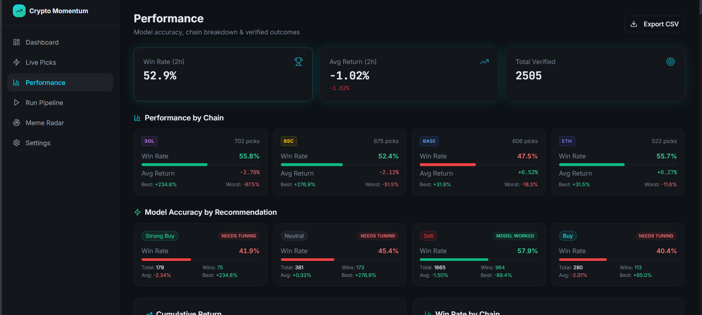
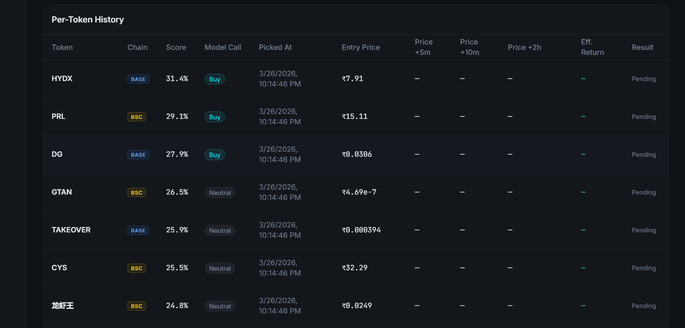
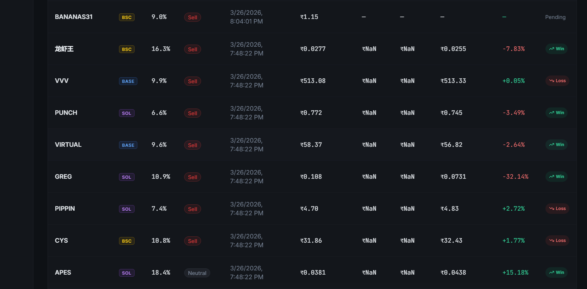
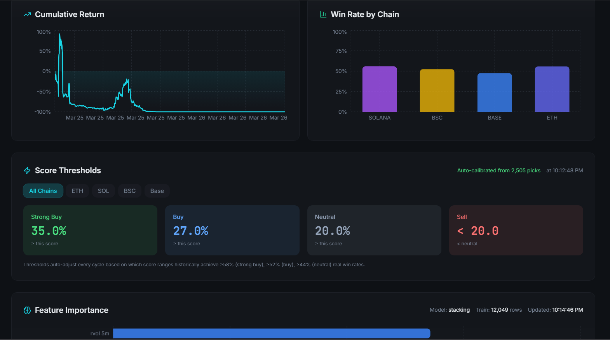
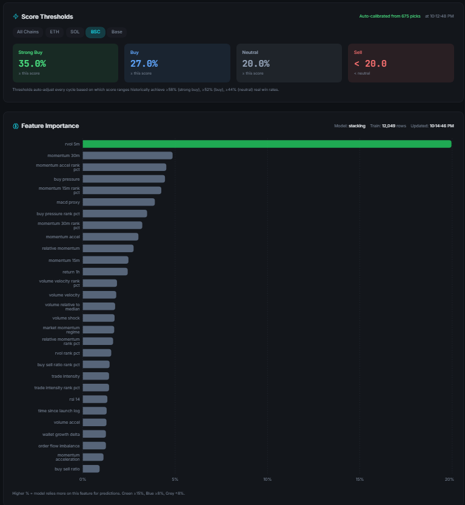
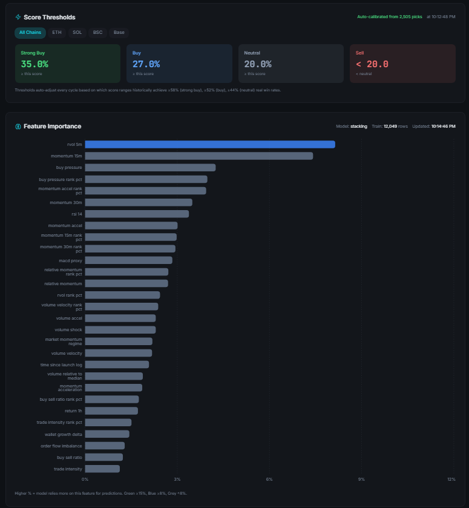

# Crypto Momentum Intelligence

A live crypto trading intelligence system that ingests 5-minute OHLCV data from GeckoTerminal across Base, BSC, Solana and ETH chains, trains a stacking ensemble ML model every tick, and surfaces buy/sell/neutral recommendations through a React dashboard.

---

## What this system does

1. **Ingests** raw swap data from GeckoTerminal every 5 minutes across four chains
2. **Builds** 5-minute OHLCV price candles, token metrics, feature signals, and forward-return labels
3. **Trains** isolated, per-chain stacking ensemble models (XGBoost + Random Forest + Extra Trees + Logistic Regression meta-learner) on all labeled data using feedback-based sample weighting from past prediction outcomes
4. **Scores** tokens and selects the top-N by model probability each tick
5. **Logs** picks and verifies them after two hours, recording win/loss and effective return in `pick_outcomes`
6. **Enriches** token names from CoinStats after each cycle to replace temporary `TKN_` placeholders with real symbols
7. **Serves** a FastAPI backend (port `8001`) consumed by a React/Vite frontend dashboard
8. **Meme Radar** analyzes trending crypto mentions from Reddit/X and matches them against CoinStats coins

---

## Prerequisites

- Python **3.11+**
- Node.js **18+**
- npm
- PostgreSQL **14+**
- Git

---

## First-time setup

### 1. Clone and create virtual environment

```powershell
git clone <repo-url>
cd crypto-momentum-intelligence
python -m venv .venv
.\.venv\Scripts\Activate.ps1
pip install -r requirements.txt
```

---

### 2. Configure environment

```powershell
copy .env.example .env
```

Edit `.env` with your values:

```dotenv
PGHOST=localhost
PGPORT=5432
PGDATABASE=crypto_momentum
PGUSER=postgres
PGPASSWORD=your_password
PGSSLMODE=disable

INGEST_NETWORKS=base,eth,solana,bsc
INGEST_MAX_POOLS=15
INGEST_MAX_TRADES_PER_POOL=30
INGEST_MAX_PAGES_PER_POOL=2
INGEST_LOOKBACK_HOURS=24

COINSTATS_API_KEY=your_coinstats_key

ALCHEMY_API_KEY=
```

---

### 3. Create database and run migrations

```powershell
psql -h localhost -p 5432 -U postgres -c "CREATE DATABASE crypto_momentum;"
```

Run migrations **in order**:

```powershell
psql -h localhost -p 5432 -U postgres -d crypto_momentum -f db/migrations/001_init_raw_schema.sql
psql -h localhost -p 5432 -U postgres -d crypto_momentum -f db/migrations/002_create_token_metrics_5m.sql
psql -h localhost -p 5432 -U postgres -d crypto_momentum -f db/migrations/003_create_features_5m.sql
psql -h localhost -p 5432 -U postgres -d crypto_momentum -f db/migrations/004_create_labels_5m.sql
psql -h localhost -p 5432 -U postgres -d crypto_momentum -f db/migrations/005_create_tracked_pools.sql
psql -h localhost -p 5432 -U postgres -d crypto_momentum -f db/migrations/006_create_token_price_5m.sql
psql -h localhost -p 5432 -U postgres -d crypto_momentum -f db/migrations/008_add_context_features_to_features_5m.sql
psql -h localhost -p 5432 -U postgres -d crypto_momentum -f db/migrations/009_add_cross_sectional_rank_features.sql
psql -h localhost -p 5432 -U postgres -d crypto_momentum -f db/migrations/010_add_regime_and_time_features.sql
psql -h localhost -p 5432 -U postgres -d crypto_momentum -f db/migrations/011_add_adaptive_label_columns.sql
```

Run them sequentially. If a migration fails, confirm the previous migration completed successfully.

> Note: migration number **007 intentionally does not exist**.

---

### 4. Install frontend dependencies

```powershell
cd frontend\alpha-whisperer-pro
npm install
cd ..\..
```

---

## Running the system

Open **three terminals** from the project root.

---

### Terminal 1 — FastAPI backend

```powershell
.\runbackend.ps1
```

Starts FastAPI at:

```
http://127.0.0.1:8001
```

---

### Terminal 2 — React frontend

```powershell
.\runfrontend.ps1
```

Open:

```
http://localhost:8080
```

---

### Terminal 3 — Live pipeline

```powershell
.\runlive.ps1 -Loop -LoopIntervalMinutes 5 -TopN 50 -IngestMaxPools 15
```

Each cycle performs:

1. Swap ingestion from GeckoTerminal
2. Candle generation
3. Feature and label construction
4. Stacking model training
5. Top-N token scoring
6. Pick logging
7. Token name enrichment
8. Pick verification after 2 hours

---

### Single tick run

```powershell
.\runlive.ps1 -TickCount 1
```

Runs the full pipeline **once** without looping.

---

## Pipeline parameters

| Parameter                 | Default   | Description                        |
| ------------------------- | --------- | ---------------------------------- |
| `-Loop`                   | off       | Run pipeline continuously          |
| `-LoopIntervalMinutes`    | 5         | Interval between ticks             |
| `-TopN`                   | 50        | Number of tokens selected per tick |
| `-IngestMaxPools`         | 15        | Maximum pools ingested             |
| `-IngestMaxPagesPerPool`  | 2         | Pages fetched per pool             |
| `-IngestMaxTradesPerPool` | 30        | Max trades fetched                 |
| `-IngestLookbackHours`    | 24        | Historical window                  |
| `-MarketApi`              | coinstats | Market data provider               |

---

## Architecture

```
GeckoTerminal API
      |
      v
swaps_raw
      |
      v
token_price_5m
      |
      v
token_metrics_5m
      |
      v
features_5m
      |
      v
labels_5m
      |
      v
Stacking Ensemble
      |
      v
pick_outcomes
      |
      v
FastAPI (port 8001)
      |
      v
React Dashboard
```

---

## ML model details

**Architecture**

Per-chain Stacking ensemble (separate models for BASE, BSC, SOL, ETH):

- XGBoost
- Random Forest
- Extra Trees
- Logistic Regression meta-learner

---

**Feature sets**

- `v2`
- `cross_rank` (percentile rankings like `rvol_rank_pct`)
- `base`

---

**Label**

```
target_adaptive_top20
```

Top 20% tokens by forward return per 5-minute bucket.

---

**Training**

- Models are trained independently per chain every pipeline tick
- Uses rows with closed 2-hour label windows
- Typical dataset size: **12k–30k rows**

---

**Feedback weighting**

| Outcome            | Sample weight |
| ------------------ | ------------- |
| Wrong prediction   | 3–6x          |
| Correct prediction | 1.5x          |

This helps the model learn more strongly from past mistakes.

---

**Pump guard**

Tokens with **>30% price change in 24h** are capped to `neutral` to avoid chasing pumps.

---

### Model recommendation labels

| Label        | Meaning                         |
| ------------ | ------------------------------- |
| `strong_buy` | High probability of strong gain |
| `buy`        | Moderate bullish signal         |
| `neutral`    | No strong directional signal    |
| `sell`       | Model predicts decline          |

Only `buy` and `strong_buy` affect portfolio return metrics.

---

**Adaptive score calibration**

Thresholds for `strong_buy`, `buy`, and `neutral` are continuously self-calibrated explicitly by the system using the trailing 14 days of verified predictions. The pipeline dynamically selects the optimal model score cutoffs per-chain that statistically meet specific win-rate target boundaries (e.g., ≥58% win rate for `strong_buy`). This automated feedback loop allows the model to naturally adapt its confidence strictness to the current market regime without manual intervention.

---

## Dashboard pages

| Page         | URL            | Description          |
| ------------ | -------------- | -------------------- |
| Dashboard    | `/`            | Latest tick overview |
| Live Picks   | `/live`        | Current model picks  |
| Performance  | `/performance` | Win rate and returns |
| Meme Radar   | `/meme-radar`  | Trending tokens      |
| Run Pipeline | `/run`         | Trigger manual tick  |
| Settings     | `/settings`    | Configuration panel  |

---

\

## Screenshots


### Dashboard Overview



### Live Momentum Picks



### Meme Radar



### Performance Overview



### Pending Predictions



### Verified Prediction Outcomes



### Win Rate & Cumulative Return



### Model Auto-Calibration & Thresholds (BSC)



### Feature Importance Tracking



## Performance metrics explained

**Win Rate**

Percentage of picks where prediction direction matched the price movement.

**Avg Return (2h)**

Average return across `buy` and `strong_buy` picks only.

Returns are capped at:

```
±500%
```

to avoid outliers distorting averages.

---

**Best / Worst Chain Cards**

Displays highest and lowest return among buy-type picks per chain.

---

**Outlier Badge**

Shown when:

```
|return| > 500%
```

These values are clipped in average calculations.

---

## Key files

| File                                       | Purpose                        |
| ------------------------------------------ | ------------------------------ |
| `run_full_live_cycle.py`                   | Orchestrates full pipeline     |
| `runlive.ps1`                              | Pipeline launcher              |
| `runbackend.ps1`                           | Starts FastAPI                 |
| `runfrontend.ps1`                          | Starts frontend                |
| `backend/api.py`                           | API endpoints                  |
| `backend/meme_radar.py`                    | Meme detection system          |
| `research/live_top_coins.py`               | Model training and scoring     |
| `research/feedback_loop.py`                | Outcome tracking and weighting |
| `research/live_picks_snapshot.csv`         | Snapshot used for verification |
| `research/feature_importance.json`         | Model feature importances      |
| `ingestion/data_sources/gecko_provider.py` | GeckoTerminal client           |
| `pipeline.log`                             | Pipeline logs                  |
| `pipeline_err.log`                         | Error logs                     |

---

## Checking pipeline status

```powershell
(Get-CimInstance Win32_Process | Where-Object { $_.Name -eq 'python.exe' -and $_.CommandLine -match 'run_full_live_cycle' } | Measure-Object).Count
```

View logs:

```powershell
Get-Content .\pipeline.log -Tail 20
```

Errors:

```powershell
Get-Content .\pipeline_err.log -Tail 10
```

---

## Stopping the pipeline

```powershell
$procs = Get-CimInstance Win32_Process | Where-Object { $_.Name -eq 'python.exe' -and $_.CommandLine -match 'run_full_live_cycle' }
$procs | ForEach-Object { Stop-Process -Id $_.ProcessId -Force }
Write-Host "Stopped $($procs.Count) process(es)"
```

---

## Database quick checks

```sql
SELECT COUNT(*) FROM swaps_raw;
SELECT COUNT(*) FROM token_price_5m;
SELECT COUNT(*) FROM features_5m;
SELECT COUNT(*) FROM labels_5m WHERE future_return_2h IS NOT NULL;
```

Latest verified picks:

```sql
SELECT symbol, recommendation, effective_return, is_win, picked_at_utc
FROM pick_outcomes
ORDER BY picked_at_utc DESC
LIMIT 20;
```

Win rate by recommendation:

```sql
SELECT recommendation,
COUNT(*) AS total,
SUM(CASE WHEN is_win THEN 1 ELSE 0 END) AS wins,
ROUND(AVG(effective_return)::NUMERIC, 2) AS avg_return_pct
FROM pick_outcomes
GROUP BY recommendation
ORDER BY recommendation;
```

Check placeholder tokens:

```sql
SELECT COUNT(*) AS placeholder_tokens
FROM tokens
WHERE symbol LIKE 'TKN_%';
```

---

## Troubleshooting

**Pipeline stalls during ingestion**

Likely GeckoTerminal rate limiting. Reduce ingestion volume:

```
-IngestMaxPools 10
```

---

**No picks generated**

Labels require a **2-hour window** to close. Picks appear only after sufficient historical data exists.

---

**Meme Radar shows no matches**

Verify `COINSTATS_API_KEY` is configured correctly in `.env`.

---

**Placeholder token names appear**

Run the enrichment script once:

```powershell
.\.venv\Scripts\python.exe research\enrich_token_names.py
```

---

**Frontend showing stale data**

- Live picks refresh every **10 seconds**
- Performance refresh every **15 seconds**

Hard refresh if needed.

---

**Database driver issue**

The environment uses:

```
psycopg v3
```

not `psycopg2`. Always run scripts using the `.venv` Python interpreter.

---

## Future Scope - Deployment

This system retrains an ML model every **5 minutes**, which requires a small VPS.

Recommended deployment:

| Component          | Platform         |
| ------------------ | ---------------- |
| Frontend           | Vercel / Netlify |
| Backend + Pipeline | VPS              |
| Database           | PostgreSQL       |

Example VPS:

```
Hetzner CX21
2 vCPU
2 GB RAM
≈ $6/month
```

or a similar DigitalOcean droplet.
